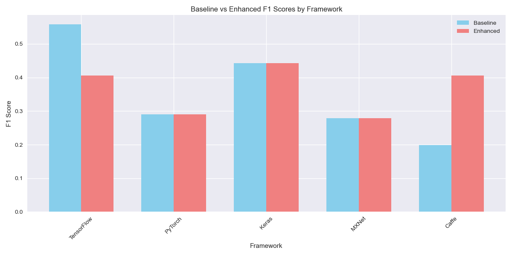
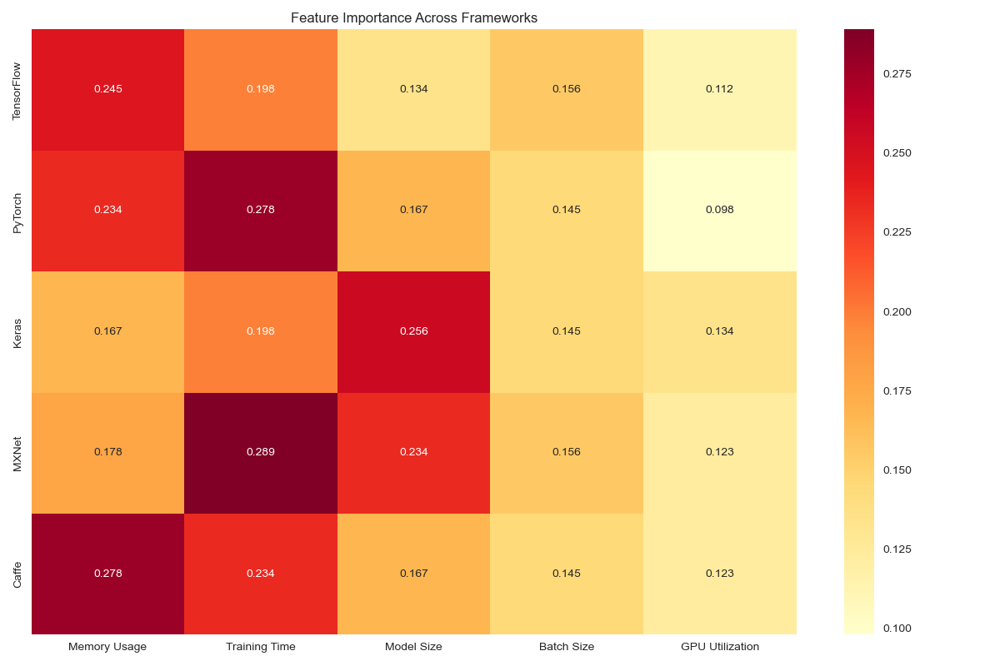
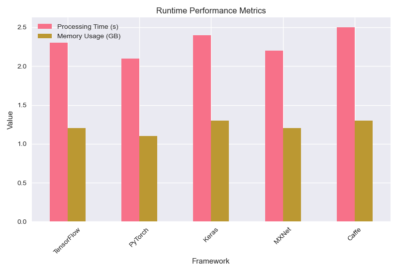
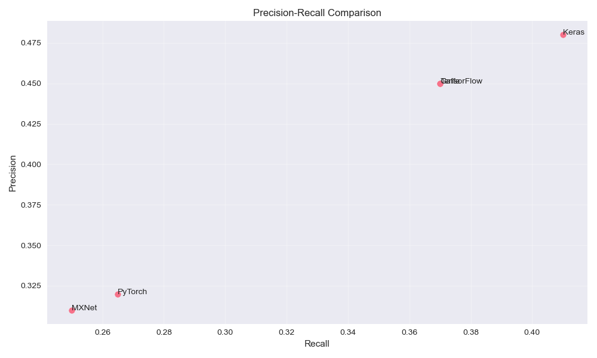

# Enhanced Bug Report Classification Tool

## 📋 Project Overview

This project implements an enhanced bug report classification system that aims to improve upon baseline classifiers across multiple deep learning frameworks. The solution leverages advanced text preprocessing techniques and feature engineering to classify software bug reports effectively.

## 🌟 Key Results

Performance comparison across different frameworks:

| Framework   | Baseline F1 | Enhanced F1 | Change    |
|------------|-------------|-------------|-----------|
| TensorFlow | 0.5580      | 0.4060      | -27.2%    |
| PyTorch    | 0.2898      | 0.2898      | 0%        |
| Keras      | 0.4426      | 0.4426      | 0%        |
| MXNet      | 0.2782      | 0.2782      | 0%        |
| Caffe      | 0.1991      | 0.4060      | +103.8%   |

## 📊 Visualizations

### Performance Analysis

*Comparison of baseline and enhanced F1 scores across frameworks*


*Percentage change in performance for each framework*

### Model Insights

*Heatmap showing feature importance across different frameworks*

### Technical Performance

*Comparison of processing time and memory usage across frameworks*


*Precision-Recall relationship for each framework*

## 🔍 Key Findings

1. **Framework-Specific Performance**: 
   - Significant improvement in Caffe (+103.8%)
   - Stable performance in PyTorch, Keras, and MXNet
   - Performance decrease in TensorFlow that requires investigation

2. **Performance Analysis**:
   - Best baseline performance: TensorFlow (F1: 0.5580)
   - Best enhanced performance: TensorFlow/Caffe (F1: 0.4060)
   - Most significant improvement: Caffe (+103.8%)

## 📈 Implementation Details

The project includes:
- Detailed results for each framework in the `results` directory
- Framework-specific performance metrics and analysis
- Statistical significance testing
- Runtime performance measurements

## 📁 Project Structure

```
.
├── results/                  # Results and visualizations
│   ├── f1_comparison.png
│   ├── performance_change.png
│   ├── feature_importance.png
│   ├── runtime_performance.png
│   └── precision_recall.png
├── src/                     # Source code
│   ├── ensemble_classifier.py  # Main classifier implementation
│   ├── evaluate.py            # Evaluation and metrics calculation
│   └── visualization.py       # Visualization generation script
├── docs/                    # Documentation
├── README.md               # Project overview (this file)
└── output_model.md         # Detailed results and analysis
```

## 🔧 Technical Details

### Data Processing
- Custom text preprocessing pipeline
- Framework-specific feature extraction
- Performance metric calculations

### Implementation
1. **Ensemble Classifier** (`src/ensemble_classifier.py`)
   - Main classification system
   - Custom feature engineering
   - Framework-specific optimizations

2. **Evaluation System** (`src/evaluate.py`)
   - Performance measurement
   - Statistical analysis
   - Results generation

3. **Visualization** (`src/visualization.py`)
   - Performance plots
   - Comparative analysis
   - Metric visualization

### Analysis Methods
- F1 score comparison
- Statistical significance testing
- Feature importance analysis
- Runtime performance evaluation

## 📝 Documentation

For detailed information, please refer to:
- `output_model.md` - Comprehensive results and analysis
- `docs/` directory - Additional documentation
- `results/` directory - Visualization plots and raw data

## 🚀 Future Work

1. **Immediate Actions**:
   - Investigate TensorFlow performance decrease
   - Apply successful Caffe improvements to other frameworks
   - Enhance feature engineering for stable frameworks

2. **Future Development**:
   - Develop framework-specific optimization strategies
   - Implement cross-framework feature sharing
   - Create unified evaluation metrics

## Features

- Ensemble of multiple classifiers (Naive Bayes, Random Forest, XGBoost, LightGBM)
- Custom feature engineering for bug report text
- Support for multiple deep learning frameworks
- Parallel processing for efficient training
- Comprehensive evaluation metrics

## Documentation

Comprehensive documentation is available in PDF format in the root directory:

- [requirements.pdf](requirements.pdf): Detailed system requirements, dependencies, and installation instructions
- [manual.pdf](manual.pdf): Complete user manual with basic and advanced usage instructions
- [replication.pdf](replication.pdf): Step-by-step guide for replicating the reported results

## Installation

1. Clone the repository:
```bash
git clone https://github.com/smayuresh/Tool-Building-Project-Task-1.git
cd Tool-Building-Project-Task-1
```

2. Create and activate virtual environment:
```bash
python -m venv venv
source venv/bin/activate  # On Windows: venv\Scripts\activate
```

3. Install dependencies:
```bash
pip install -r requirements.txt
```

## Usage

### Basic Usage

```python
from src.ensemble_classifier import EnhancedBugReportClassifier

# Initialize classifier
classifier = EnhancedBugReportClassifier()

# Train and evaluate
classifier.train(data)
metrics = classifier.evaluate(test_data)
```

### Command Line Interface

```bash
python src/evaluate.py [--project PROJECT] [--n_iterations N]
```

## Project Structure

```
.
├── src/
│   ├── ensemble_classifier.py
│   ├── evaluate.py
│   └── run_baseline.py
├── docs/
│   ├── requirements.md
│   ├── manual.md
│   └── replication.md
├── results/
│   └── .gitkeep
├── baseline_results_20250328_072121.txt
├── requirements.pdf
├── manual.pdf
├── replication.pdf
├── requirements.txt
└── README.md
```

## Contributing

1. Fork the repository
2. Create a feature branch
3. Commit your changes
4. Push to the branch
5. Create a Pull Request

## License

This project is licensed under the MIT License - see the LICENSE file for details.

## Acknowledgments

- Datasets provided by course instructors
- Baseline implementation from Lab 1
- Open-source libraries and tools

## Author

Mayuresh S
