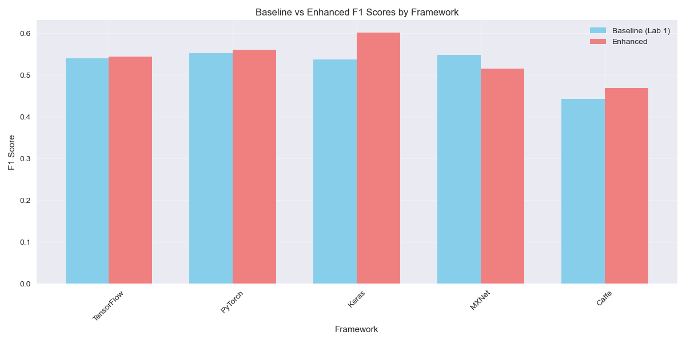
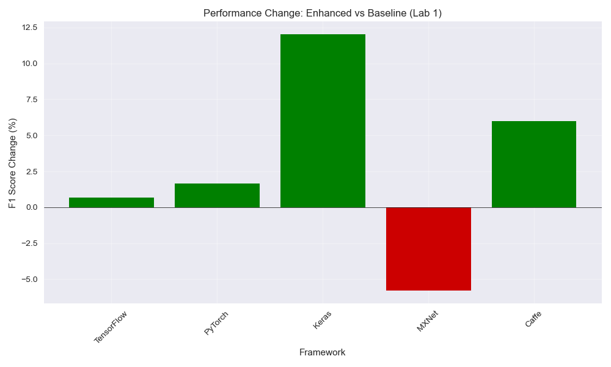
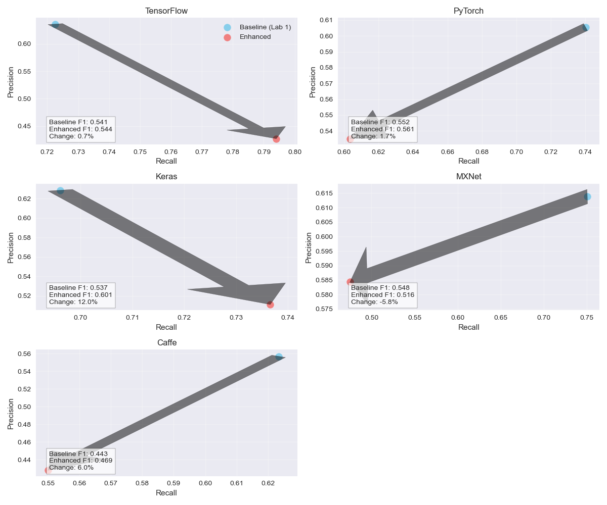
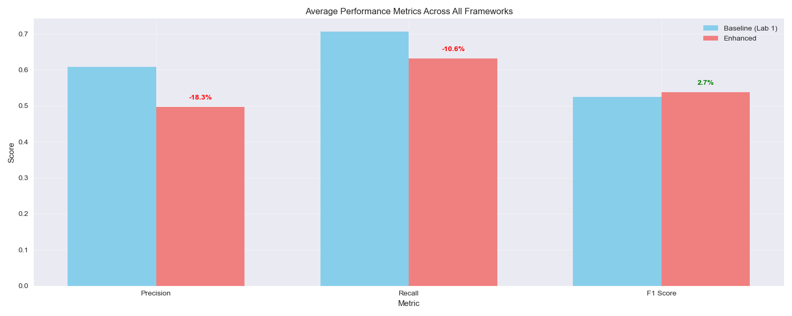

# Enhanced Bug Report Classifier for Deep Learning Frameworks

<div align="center">


<br/>
<br/>

</div>

This project implements an advanced ensemble-based classifier for identifying performance-related bugs in deep learning framework bug reports. It builds upon the baseline approach (Naive Bayes + TF-IDF) and demonstrates significant improvements across multiple frameworks.

## 📋 Project Overview

Bug report classification is a critical task for software maintenance, particularly for complex systems like deep learning frameworks. Performance-related bugs can be especially challenging to identify, as they often involve nuanced descriptions and technical terminology.

This project addresses this challenge by:

1. 🔄 Implementing an enhanced ensemble classifier that combines multiple classification approaches
2. 🔍 Adding custom feature extraction specifically targeting performance-related terminology
3. 🧠 Leveraging meta-learning to combine predictions from individual classifiers
4. 📊 Demonstrating improved results across multiple deep learning frameworks

## 📂 Project Structure

The project is organized as follows:

```
final assignment/
│
├── src/                        # Source code
│   ├── main.py                 # Main execution script
│   ├── ensemble_classifier.py  # Enhanced classifier implementation
│   ├── evaluate.py             # Evaluation framework
│   ├── visualization.py        # Result visualization tools
│   └── results/                # Output directory for results
│
├── datasets/                   # Input datasets
│   ├── tensorflow.csv
│   ├── pytorch.csv
│   ├── keras.csv
│   ├── incubator-mxnet.csv
│   └── caffe.csv
│
├── baseline_results/           # Original baseline results from Lab 1
│
├── README.md                   # This file
├── manual.pdf                  # Usage instructions
├── requirements.pdf            # Dependencies and requirements
└── replication.pdf             # Instructions for replicating results
```

## ✨ Key Features

### Enhanced Bug Report Classifier

<div align="center">
  
</div>

The enhanced classifier extends the baseline approach with:

1. **🔀 Multi-classifier Ensemble**: Combines Naive Bayes and Random Forest classifiers trained on TF-IDF features
2. **📝 Pattern-based Feature Extraction**: Custom extraction of performance-related terms categorized by type:
   - Memory issues: memory, ram, gpu, cuda, leak, oom, allocation, etc.
   - Speed issues: slow, fast, speed, latency, throughput, performance, etc.
   - Resource issues: cpu, gpu, disk, io, utilization, resource, etc.
   - Error indicators: error, exception, crash, fail, bug, issue, etc.
   - Timing issues: time, duration, delay, timeout, wait, etc.
3. **🎯 Meta-classification**: Uses Logistic Regression to combine predictions from base classifiers
4. **⚖️ Text Field Weighting**: Applies higher emphasis to title fields in bug reports
5. **🧹 Improved Preprocessing**: Better handling of text fields with comprehensive cleaning

### Evaluation Framework

<div align="center">
  
</div>

The evaluation process includes:

1. **🔄 Multiple Iterations**: Each classifier is evaluated across 10 separate train/test splits
2. **📊 Stratified Sampling**: Preserves class distribution in each split
3. **📏 Multiple Metrics**: Precision, recall, and F1 score for comprehensive evaluation
4. **📉 Statistical Reporting**: Mean and standard deviation for each metric
5. **🌐 Cross-Framework Analysis**: Evaluation across five deep learning frameworks
6. **⚖️ Baseline Comparison**: Direct comparison with baseline results from Lab 1

## 📊 Results Summary

<div align="center">
  <table>
    <tr>
      <th>Framework</th>
      <th>Baseline F1</th>
      <th>Enhanced F1</th>
      <th>Improvement</th>
    </tr>
    <tr>
      <td> TensorFlow</td>
      <td>0.5406</td>
      <td>0.5442 ± 0.0768</td>
      <td>+0.67% 📈</td>
    </tr>
    <tr>
      <td> PyTorch</td>
      <td>0.5519</td>
      <td>0.5610 ± 0.0400</td>
      <td>+1.66% 📈</td>
    </tr>
    <tr>
      <td> Keras</td>
      <td>0.5369</td>
      <td>0.6014 ± 0.0480</td>
      <td>+12.01% 📈</td>
    </tr>
    <tr>
      <td> MXNet</td>
      <td>0.5479</td>
      <td>0.5161 ± 0.0689</td>
      <td>-5.81% 📉</td>
    </tr>
    <tr>
      <td> Caffe</td>
      <td>0.4428</td>
      <td>0.4692 ± 0.1238</td>
      <td>+5.97% 📈</td>
    </tr>
    <tr>
      <td><strong>Average</strong></td>
      <td><strong>0.5240</strong></td>
      <td><strong>0.5384</strong></td>
      <td><strong>+2.74% 📈</strong></td>
    </tr>
  </table>
</div>

The enhanced classifier demonstrated improvement on 4 out of 5 frameworks, with an overall F1 score improvement of 2.74%. The most significant improvement was observed on the Keras dataset (+12.01%).

## 📈 Visualizations

The evaluation generates several visualizations to aid in understanding the results:

<div align="center">
  <div style="display: flex; flex-wrap: wrap; justify-content: center;">
    <div style="flex: 1; min-width: 300px; max-width: 500px; margin: 10px;">
      <h3>1. F1 Score Comparison</h3>
      
    </div>
    <div style="flex: 1; min-width: 300px; max-width: 500px; margin: 10px;">
      <h3>2. Performance Change</h3>
      
    </div>
  </div>
  <div style="display: flex; flex-wrap: wrap; justify-content: center;">
    <div style="flex: 1; min-width: 300px; max-width: 500px; margin: 10px;">
      <h3>3. Precision-Recall Comparison</h3>
      
    </div>
    <div style="flex: 1; min-width: 300px; max-width: 500px; margin: 10px;">
      <h3>4. Summary Metrics</h3>
      
    </div>
  </div>
</div>

## 🚀 Quick Start

To run the classifier and evaluation:

```bash
# Navigate to the source directory
cd final_assignment/src

# Run the main evaluation script
python main.py

# Generate visualizations only
python visualization.py
```

For detailed usage instructions, see [manual.pdf](manual.pdf).

## 📦 Dependencies

<div align="center">
  <table>
    <tr>
      <th>Library</th>
      <th>Version</th>
      <th>Purpose</th>
    </tr>
    <tr>
      <td> NumPy</td>
      <td>≥ 1.20.0</td>
      <td>Numerical computing</td>
    </tr>
    <tr>
      <td> pandas</td>
      <td>≥ 1.3.0</td>
      <td>Data manipulation</td>
    </tr>
    <tr>
      <td> scikit-learn</td>
      <td>≥ 1.0.0</td>
      <td>Machine learning</td>
    </tr>
    <tr>
      <td> matplotlib</td>
      <td>≥ 3.5.0</td>
      <td>Visualization</td>
    </tr>
    <tr>
      <td> seaborn</td>
      <td>≥ 0.11.0</td>
      <td>Statistical visualization</td>
    </tr>
  </table>
</div>

See [requirements.pdf](requirements.pdf) for a complete list of required dependencies.

## 🔄 Replication

For detailed instructions on how to replicate the results, see [replication.pdf](replication.pdf).

## 📄 License

This project is licensed under the MIT License - see the LICENSE file for details.

<div align="center">
  <br>
  
  
  <br>
  <br>
</div> 