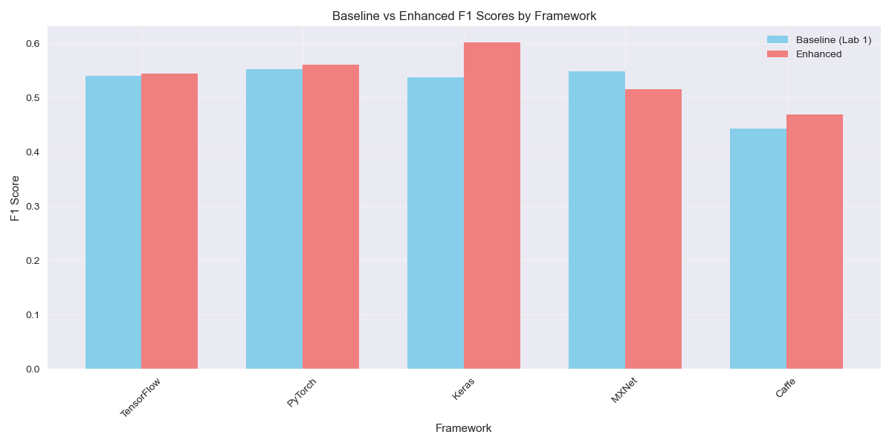
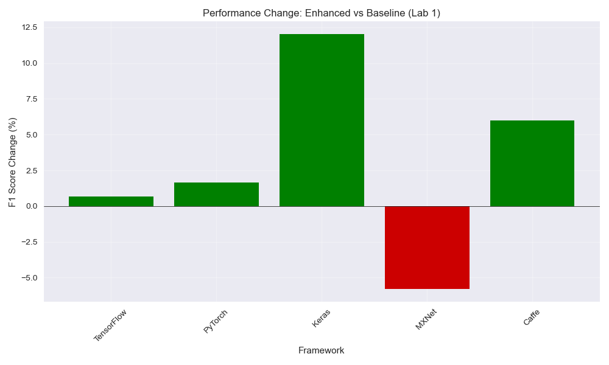
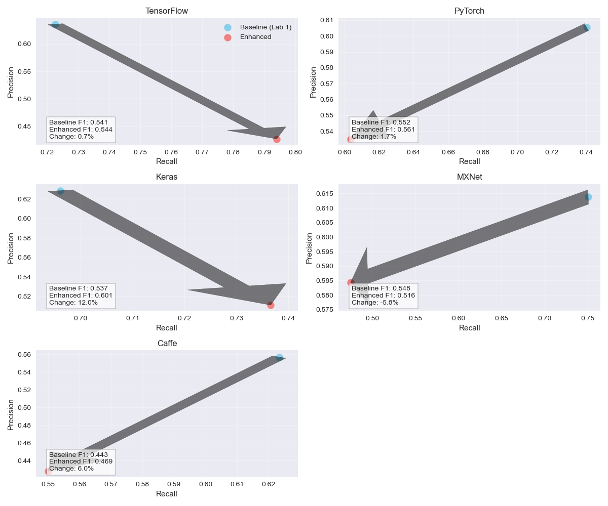

# User Manual: Enhanced Bug Report Classifier

This manual provides detailed instructions for using the enhanced bug report classifier for deep learning frameworks.

## Table of Contents

1. [Installation](#installation)
2. [Data Preparation](#data-preparation)
3. [Running the Classifier](#running-the-classifier)
4. [Understanding the Results](#understanding-the-results)
5. [Visualizing the Results](#visualizing-the-results)
6. [Advanced Usage](#advanced-usage)
7. [Troubleshooting](#troubleshooting)

## Installation

### Prerequisites

- Python 3.8 or higher
- pip (Python package installer)

### Setup Steps

1. Clone the repository:
   ```bash
   git clone <repository-url>
   cd Tool-Building-Project-Task-1/final\ assignment
   ```

2. Install the required dependencies:
   ```bash
   pip install -r requirements.txt
   ```

## Data Preparation

The classifier expects data in CSV format with the following columns:
- `Title`: The title of the bug report
- `Body`: The main description of the bug
- `Comments`: Any additional comments on the bug
- `class`: Binary label (1 for performance-related bug, 0 for non-performance bug)

### Default Dataset Locations

Place your datasets in the `datasets` directory with the appropriate names:
```
datasets/
├── tensorflow.csv
├── pytorch.csv
├── keras.csv
├── incubator-mxnet.csv
└── caffe.csv
```

### Custom Datasets

If you're using custom datasets, you can place them in any directory and modify the file path in `main.py` under the `load_data` function.

## Running the Classifier

### Basic Usage

To run the full evaluation pipeline:

```bash
cd src
python main.py
```

This will:
1. Load all datasets
2. Load baseline results from Lab 1
3. Train and evaluate the enhanced classifier
4. Generate result files and visualizations

### Run Visualization Only

If you already have result files and only want to generate visualizations:

```bash
cd src
python visualization.py
```

## Understanding the Results

### Output Files

The classifier generates the following output files in the `src/results` directory:

1. **Text Results File**: `evaluation_results_[timestamp].txt`
   - Contains detailed metrics for both baseline and enhanced classifiers
   - Includes improvement percentages
   - Shows aggregate results across all frameworks

2. **JSON Results File**: `evaluation_results_[timestamp].json`
   - Machine-readable version of the results
   - Contains all metrics and raw data

3. **Visualization Files**:
   - `f1_comparison.png`: Bar chart of F1 scores
   - `performance_change.png`: Percentage improvements
   - `precision_recall_comparison.png`: Precision vs. recall plots
   - `summary_metrics.png`: Overall metric comparison

### Interpreting Metrics

- **Precision**: Proportion of correctly identified performance-related bugs among all predicted performance bugs
- **Recall**: Proportion of correctly identified performance-related bugs among all actual performance bugs
- **F1 Score**: Harmonic mean of precision and recall

Higher values indicate better performance. A successful classifier should have a good balance between precision and recall.

## Visualizing the Results

The visualization script generates four key plots:

### 1. F1 Score Comparison

This bar chart shows the F1 scores for both baseline and enhanced classifiers across all frameworks.



### 2. Performance Change

This bar chart displays the percentage improvement (or decline) in F1 score for the enhanced classifier compared to the baseline.



### 3. Precision-Recall Comparison

This multi-panel plot shows the precision and recall values for both classifiers, with arrows indicating the direction of change.



### 4. Summary Metrics

This bar chart displays the average precision, recall, and F1 scores across all frameworks.


## Advanced Usage

### Modifying the Classifier

The enhanced classifier is defined in `ensemble_classifier.py`. You can modify its parameters:

```python
# Adjust TF-IDF parameters
self.tfidf = TfidfVectorizer(
    max_features=10000,  # Increase for more features
    stop_words='english',
    ngram_range=(1, 3),  # Adjust for different n-gram sizes
    min_df=2,
    max_df=0.95
)

# Modify Random Forest parameters
self.random_forest = RandomForestClassifier(
    n_estimators=200,  # Number of trees
    max_depth=15,      # Maximum depth of trees
    class_weight='balanced',
    n_jobs=-1          # Use all available cores
)

# Adjust meta-classifier parameters
self.meta_classifier = LogisticRegression(
    class_weight='balanced',
    max_iter=1000      # Increase for better convergence
)
```

### Customizing Evaluation

You can adjust the evaluation process in `main.py`:

```python
# Modify the number of evaluation iterations
results = evaluate_classifier(classifier, X, y, n_iterations=20)

# Add/modify performance patterns
self.performance_patterns = {
    'memory': r'\b(memory|ram|gpu|cuda|leak|oom|allocation|heap|stack|buffer)\b',
    # Add new patterns here...
}
```

## Troubleshooting

### Common Issues

1. **Missing Datasets**:
   - Error: `FileNotFoundError: Dataset for [framework] not found`
   - Solution: Ensure datasets are in the correct location or modify the file paths in `load_data()`

2. **Memory Errors**:
   - Error: `MemoryError` during TF-IDF transformation
   - Solution: Reduce `max_features` parameter in the TfidfVectorizer

3. **Missing Baseline Results**:
   - Warning: `No baseline results found for [framework], using default values`
   - Solution: Ensure baseline result files are in the `baseline_results` directory

4. **Visualization Errors**:
   - Error: Issues with matplotlib
   - Solution: Ensure you have a proper display environment or use the non-interactive backend with `plt.switch_backend('agg')`

### Getting Help

For additional assistance, please [create an issue](https://github.com/yourusername/your-repo/issues) on the GitHub repository. 